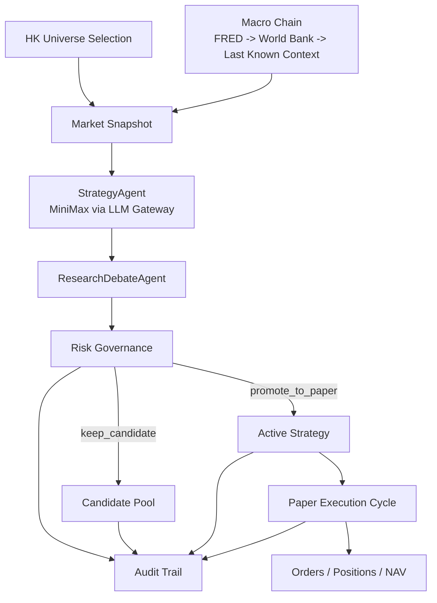

# GobyShrimp

GobyShrimp is an auditable strategy factory for HK market research and paper trading.
It combines market-aware LLM research, deterministic governance, a paper ledger, and an operator dashboard into one reviewable workflow.

The current delivery is focused on one narrow, defensible path:
- HK-only market scope
- dynamic HK universe selection
- MiniMax as the default live LLM provider
- macro-only context pipeline
- local paper trading ledger with audit trail

## Why GobyShrimp

Most agent trading demos optimize for novelty.
GobyShrimp optimizes for control.

The system is built to answer questions that matter before any real capital path exists:
- What symbol is the system researching right now, and why?
- What strategy was proposed, by which provider, under which prompt contract?
- Why was a proposal rejected, kept as candidate, or promoted to paper?
- If paper NAV is flat, was that because price did not move, because no rebalance was needed, or because execution stalled?
- Is the macro pipeline healthy, degraded, or running on last known context?

## Current Product Shape

### Backend
- FastAPI API under `src/goby_shrimp/api`
- SQLAlchemy + Alembic for business data
- dedicated runtime state store for high-frequency status
- runtime scheduler under `src/goby_shrimp/runtime`

### Frontend
- Vue 3 dashboard under `apps/web`
- operator views:
  - `/command`
  - `/candidates`
  - `/research`
  - `/paper`
  - `/audit`

### Runtime Artifacts
- `var/db` for SQLite stores
- `var/cache` for data cache
- `var/logs` for local runtime logs

## What It Does Today

### 1. Selects an HK symbol from the market
GobyShrimp no longer runs on a single hardcoded instrument.
The current universe mode is `dynamic_hk`.

Selection flow:
1. load HK spot candidates
2. filter for valid symbols and minimum turnover
3. rank by liquidity, momentum, stability, price quality
4. enrich top candidates with multi-day factors
5. penalize missing history windows
6. select the top-ranked symbol as the current research target

The selected symbol, top factors, and ranking rationale are exposed in the dashboard and audit trail.

### 2. Builds a market-aware research context
The system constructs a `market_snapshot` with:
- HK market profile
- selected symbol and universe rationale
- macro digest
- regime and volatility context
- preferred and discouraged strategy tags for the current market

### 3. Generates structured strategy proposals with MiniMax
The LLM path is routed through a single `LLM Gateway`.

Current runtime providers:
- `minimax`
- `mock`

Prompt contracts live under `src/goby_shrimp/prompts`:
- `market_analyst`
- `strategy_agent`
- `research_debate`
- `risk_manager_llm`

The system does not let the model emit arbitrary executable code.
It produces structured strategy proposals and governance artifacts instead.

### 4. Applies deterministic governance
A proposal must clear:
- hard risk gates
- score thresholds
- challenger delta rules
- cooldown rules
- macro lane health requirements
- paper acceptance rules

Governance outputs include:
- `phase`
- `next_step`
- `resume_conditions`
- promotion ETA
- blocked reasons

### 5. Runs a local paper ledger
When a proposal is promoted to paper, GobyShrimp:
- initializes NAV
- boots a first paper trade using live market price
- records orders, positions, and NAV updates locally
- keeps evaluating the active strategy on each runtime cycle

Important boundary:
- prices come from live market data providers
- orders, positions, and NAV are simulated in a local paper ledger
- this is not broker execution

## Architecture



## Dashboard Views

### `/command`
Operator command center for:
- runtime heartbeat and pipeline stage
- active strategy and latest execution result
- current HK universe selection and factor breakdown
- macro lane health
- candidate pool distribution
- baseline strategy catalog

### `/candidates`
Candidate ladder for:
- ranking
- governance phase
- cooldown state
- promotion eligibility
- pool comparison

### `/research`
Proposal review view for:
- market understanding
- universe selection rationale
- baseline fit
- strategy DSL
- debate report
- evidence pack
- quality report
- promotion blockers

### `/paper`
Paper trading view for:
- NAV curve
- positions
- orders
- active strategy
- operational acceptance
- latest execution explanation
- price freshness and rebalance reason

### `/audit`
Audit ledger for:
- decision timeline
- universe selection events
- macro degradation / recovery
- provider fallback events
- governance cause chain

## Runtime Status

The command center exposes runtime heartbeat fields so operators can see whether the system is actively progressing:
- `current_state`
- `current_stage`
- `stage_started_at`
- `stage_durations_ms`
- `last_run_at`
- `last_success_at`
- `last_failure_at`
- `consecutive_failures`
- `expected_next_run_at`
- `last_trigger`

The pipeline currently reports stage-level progress across:
- event sync
- digest sync
- market snapshot build
- market analyst
- strategy generation
- decision materialization
- paper execution

## Market and Data Scope

### Current market scope
- HK-only
- default benchmark context anchored to HK market profile
- dynamic universe selection instead of a fixed symbol list

### Price data routing
HK price data currently routes through:
- `tencent`
- `akshare`
- `yfinance`
- `stooq`

### Macro data routing
Macro context currently routes through:
- `FRED`
- `World Bank`
- last known context fallback

### What is intentionally excluded
- news and announcement pipelines
- real broker execution
- multi-market live trading
- automatic production trading

## Quick Start

### Backend
```bash
pip install -e .[dev]
alembic upgrade head
gobyshrimp-api
```

### Frontend
```bash
npm install --prefix apps/web
npm run dev --prefix apps/web
```

Default local endpoints:
- Frontend: `http://127.0.0.1:5173`
- Backend: `http://127.0.0.1:8000`

## Configuration

Configuration precedence:

```text
defaults < config/base.yaml < config/local.yaml < .env < .env.local < environment variables
```

Recommended local secrets in `.env.local`:
- `MINIMAX_API_KEY`
- `FRED_API_KEY`

Useful runtime-related environment overrides:
- `LLM_PROVIDER=minimax`
- `LLM_MODEL=MiniMax-M2.5`
- `LLM_TEMPERATURE=0.3`
- `DATABASE_URL=sqlite:///var/db/gobyshrimp.db`

Reference files:
- `config/base.yaml`
- `config/local.yaml`
- `.env.example`
- `docs/configuration.md`

## Manual Operations

### Trigger research immediately
- API: `POST /api/v1/runtime/sync`
- Dashboard: `Run Now`

### Runtime LLM status
- API: `GET /api/v1/runtime/llm`

### Acceptance report
- API: `GET /api/v1/ops/acceptance-report?window_days=30`
- Script:
  - `python scripts/generate_acceptance_report.py`
  - `python scripts/generate_acceptance_report.py --window-days 30 --format json`

## Validation Baseline

Current local baseline:
- `pytest tests -q` -> `122 passed, 8 skipped`
- `npm run build --prefix apps/web` -> passed

## Release Status

Current implementation status:
- engineering refactor: `92%`
- product readiness: `98%`
- auditable strategy factory target: `94%`

What is already true:
- HK-only market-aware research path is active
- MiniMax live path is integrated
- runtime scheduler is real, not fake status only
- paper ledger records orders, positions, and NAV
- governance, ETA, and audit trail are visible in the dashboard

What still needs time, not a redesign:
- longer live operating history
- thicker long-horizon quality statistics
- more mature provider health history

## Project Layout

```text
apps/web/                 Vue dashboard
config/                   tracked system config
src/goby_shrimp/api/      FastAPI app, DTOs, services
src/goby_shrimp/data/     market data providers and universe logic
src/goby_shrimp/events/   macro provider chain
src/goby_shrimp/prompts/  agent prompt contracts
src/goby_shrimp/risk/     risk models and review helpers
src/goby_shrimp/runtime/  scheduler and runtime control
src/goby_shrimp/strategy/ strategy registry and plugins
var/db/                   local business DB + runtime state DB
```

## Documentation
- `docs/ARCHITECTURE.md`
- `docs/PROJECT_OVERVIEW.md`
- `docs/IMPLEMENTATION_STATUS.md`
- `docs/DECISIONS.md`
- `docs/configuration.md`
- `docs/RUNBOOK.md`

## Known Limits
- SQLite is still the delivery default, not the final operating database
- paper execution is simulated, not routed to a broker
- macro context is intentionally narrow and excludes news and announcements
- long-horizon validation still depends on accumulating more live runtime history

## Roadmap

### Near term
- accumulate longer operating history
- improve long-horizon quality statistics
- harden provider health history and recovery semantics
- continue tightening paper execution explanations and audit drill-down

### Later
- PostgreSQL migration when operating load justifies it
- richer market-aware strategy catalog
- stronger runtime operations history and reporting
