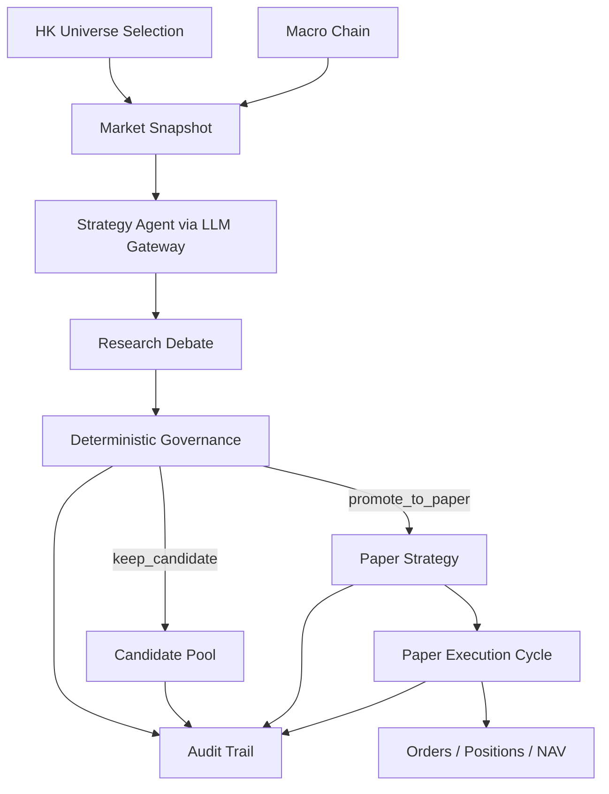

# OpenHamster

[中文 README](README.zh-CN.md) · [Project Site](https://nullwuwu.github.io/openhamster/)

<p align="center">
  
</p>

[](https://www.python.org/)
[](https://vuejs.org/)
[](LICENSE)
[](https://nullwuwu.github.io/openhamster/)

> A background strategy lab that keeps the wheel turning: market-aware LLM research, deterministic governance, and audit-first paper trading.

## Why This Exists

Most agent-trading demos optimize for novelty. OpenHamster optimizes for controlled persistence.

It is built to answer operational questions before any real-capital path exists:
- What symbol is being researched right now, and why?
- Which provider and prompt contract produced the current proposal?
- Why was a proposal rejected, kept as a candidate, or promoted to paper?
- If paper NAV is flat, was that caused by price, rebalance logic, or runtime failure?
- Is the macro pipeline healthy, degraded, or running on last known context?

## What OpenHamster Does

- Dynamic HK universe selection instead of one hardcoded symbol
- Market-aware strategy generation through a single `LLM Gateway`
- Deterministic governance with clear promotion and rejection reasons
- Local paper ledger for orders, positions, and NAV
- Audit-first dashboard for runtime, research, paper, and decision history

Current runtime providers:
- `minimax`
- `mock`

Current market/data scope:
- HK-only market flow
- price routing via `tencent`, `akshare`, `yfinance`, `stooq`
- macro routing via `FRED`, `World Bank`, and last known context

Explicitly out of scope:
- broker execution
- automatic live trading
- legacy MCP / orchestrator paths
- news-driven production trading flows

## Product Shape

```text
Backend API      src/openhamster/api
Frontend         apps/web
LLM gateway      src/openhamster/llm_gateway.py
Event pipeline   src/openhamster/events
Runtime storage  var/db, var/logs, var/cache
```



## Dashboard Views

- `/command`: runtime heartbeat, slot focus, blockers, paper summary
- `/candidates`: challenger ranking, cooldown, promotion eligibility
- `/research`: proposal evidence, market rationale, debate and quality report
- `/paper`: active strategy, holdings, NAV curve, execution explanation
- `/audit`: decision timeline, universe changes, provider and macro events

## Quick Start

### Backend

```bash
pip install -e .[dev]
alembic upgrade head
openhamster-api
```

### Frontend

```bash
npm install --prefix apps/web
npm run dev --prefix apps/web
```

Default local endpoints:
- frontend: `http://127.0.0.1:5173`
- backend: `http://127.0.0.1:8000`

Production-style local run on a Mac mini:

```bash
bash scripts/start_local_daemon.sh
```

## Configuration

Configuration precedence:

```text
defaults < config/base.yaml < config/local.yaml < .env < .env.local < environment variables
```

Recommended secret placement:
- non-secret local overrides: `config/local.yaml`
- secrets: `.env.local`
- runtime switches: database-backed runtime overrides

Primary references:
- [docs/configuration.md](docs/configuration.md)
- [docs/CONFIG_BOUNDARIES.md](docs/CONFIG_BOUNDARIES.md)
- [docs/RUNBOOK.md](docs/RUNBOOK.md)

## Open Source Guide

- [CONTRIBUTING.md](CONTRIBUTING.md)
- [SECURITY.md](SECURITY.md)
- [CODE_OF_CONDUCT.md](CODE_OF_CONDUCT.md)
- [docs/README.md](docs/README.md)

## Release

- Current public milestone: `0.2.0`
- GitHub repository: [nullwuwu/openhamster](https://github.com/nullwuwu/openhamster)
- GitHub Pages: [nullwuwu.github.io/openhamster](https://nullwuwu.github.io/openhamster/)

## Roadmap

- Harden the strategy factory and audit chain around the current HK scope
- Finish the backtest and experiment surfaces exposed under `/api/v1`
- Improve operator-facing evidence packs and daily event digest quality
- Keep live-trading admission strictly separate from paper-trading success
