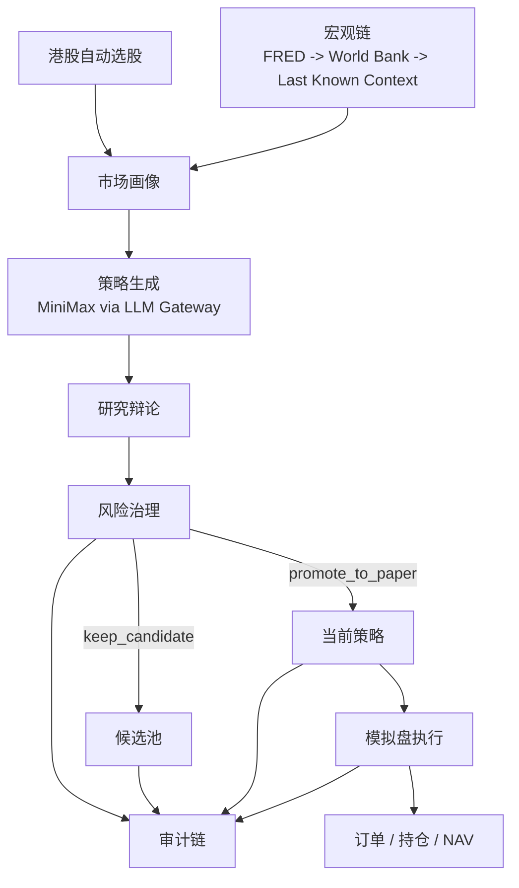

# GobyShrimp

[English README](README.md)

> 一个面向港股的可审计策略工厂，聚焦市场感知型 LLM 研究、确定性治理与本地模拟盘。

## 项目概览

GobyShrimp 不是一个通用“自动交易机器人”。它更像一个受控的研究与模拟盘系统，重点是在真实资金路径之前，先把研究、治理、审计和运行状态讲清楚。

当前范围：
- 仅支持港股主线
- 港股全市场动态选股
- 默认真实 LLM 为 MiniMax
- 仅保留宏观上下文链路
- 本地模拟盘账本与审计链

## 为什么是 GobyShrimp

很多 Agent 交易 demo 追求“新奇感”，GobyShrimp 更强调“可控性”。

它要能回答这些问题：
- 系统现在在研究哪个标的，为什么是它？
- 当前策略是谁提出来的，用了哪个 provider、哪个 prompt 契约？
- 为什么这条策略被拒绝、保留为候选，或者晋级到模拟盘？
- 如果模拟盘净值不动，是因为价格没变、无需调仓，还是执行异常？
- 宏观链当前是健康、降级，还是在复用最近一次可用上下文？

## 当前能力

### 1. 港股自动选股

系统已经不再固定死跑某一个标的，而是使用 `dynamic_hk` 动态选股：
1. 加载港股候选快照
2. 过滤合法代码和最低成交额门槛
3. 按流动性、动量、稳定性、价格质量做排序
4. 对头部候选补充多日因子
5. 对历史窗口缺失的标的施加惩罚
6. 选出当前研究标的

### 2. 市场感知型画像

系统会构建 `market_snapshot`，其中包含：
- 港股市场画像
- 当前选中标的与选股原因
- 宏观摘要
- regime 与波动环境
- 当前市场更偏好的策略标签和不鼓励的策略标签

### 3. MiniMax 真实策略生成

所有 LLM 调用统一经过 `LLM Gateway`。
当前运行时 provider：
- `minimax`
- `mock`

Prompt 契约位于 `src/goby_shrimp/prompts`：
- `market_analyst`
- `strategy_agent`
- `research_debate`
- `risk_manager_llm`

模型输出的是结构化策略提案，而不是任意可执行代码。

### 4. 确定性治理

策略提案必须经过以下治理门禁：
- 硬性风险红线
- 评分阈值
- 挑战者分差规则
- 冷却期规则
- 宏观链健康要求
- 模拟盘验收规则

治理输出包括：
- `phase`
- `next_step`
- `resume_conditions`
- 晋级 ETA
- 阻断原因

### 5. 本地模拟盘账本

当策略晋级到模拟盘时，系统会：
- 初始化 NAV
- 用最新市场价格建立首笔 paper trade
- 本地记录订单、持仓和净值
- 在每一轮 runtime 周期里持续评估 active strategy

重要边界：
- 价格来自真实市场数据源
- 订单、持仓和净值是本地模拟账本
- 这不是券商真实执行

## 系统架构



## Dashboard 页面

### `/command`
- 运行心跳与 pipeline 阶段
- 当前策略与最近一次执行结果
- 港股选股结果与因子拆解
- 宏观健康状态
- 候选池分布
- baseline 策略目录

### `/candidates`
- 候选排名
- 治理阶段
- 冷却状态
- 晋级资格
- 池内对比

### `/research`
- 市场理解
- 选股原因
- baseline 适配
- 策略 DSL
- 辩论结果
- 证据包
- 质量报告
- 阻断原因

### `/paper`
- 净值曲线
- 持仓
- 订单
- 当前策略
- 运营验收
- 价格 freshness
- 调仓解释

### `/audit`
- 决策时间线
- 选股历史
- 宏观降级/恢复
- provider fallback
- 治理因果链

## 运行状态

Command center 会直接展示：
- `current_state`
- `current_stage`
- `stage_started_at`
- `stage_durations_ms`
- `last_run_at`
- `last_success_at`
- `last_failure_at`
- `consecutive_failures`
- `expected_next_run_at`
- `last_trigger`

当前阶段覆盖：
- 事件同步
- 摘要同步
- 市场画像构建
- market analyst
- 策略生成
- 决策落盘
- 模拟盘执行

## 市场与数据范围

### 当前范围
- 仅港股主线
- 市场感知型研究
- 动态选股

### 价格数据链路
- `tencent`
- `akshare`
- `yfinance`
- `stooq`

### 宏观链路
- `FRED`
- `World Bank`
- `last known context`

### 明确不做
- 新闻与公告链路
- 券商真实执行
- 多市场实盘
- 自动实盘交易

## 快速开始

### 后端
```bash
pip install -e .[dev]
alembic upgrade head
gobyshrimp-api
```

### 前端
```bash
npm install --prefix apps/web
npm run dev --prefix apps/web
```

默认本地入口：
- Frontend: `http://127.0.0.1:5173`
- Backend: `http://127.0.0.1:8000`

Mac mini 长期运行推荐方式：
```bash
bash scripts/start_local_daemon.sh
```

生产形态本地入口：
- Dashboard + API：`http://127.0.0.1:8000`

## 配置

配置优先级：

```text
defaults < config/base.yaml < config/local.yaml < .env < .env.local < environment variables
```

建议放入 `.env.local` 的密钥：
- `MINIMAX_API_KEY`
- `FRED_API_KEY`

常用运行时覆盖：
- `LLM_PROVIDER=minimax`
- `LLM_MODEL=MiniMax-M2.5`
- `LLM_TEMPERATURE=0.3`
- `DATABASE_URL=sqlite:///var/db/gobyshrimp.db`

参考文件：
- `config/base.yaml`
- `config/local.yaml`
- `.env.example`
- `docs/configuration.md`

## 手动操作

### 立即触发研究
- API: `POST /api/v1/runtime/sync`
- Dashboard: `Run Now`

### 查看 LLM 运行状态
- API: `GET /api/v1/runtime/llm`

### 运行验收报告
- API: `GET /api/v1/ops/acceptance-report?window_days=30`
- Script:
  - `python scripts/generate_acceptance_report.py`
  - `python scripts/generate_acceptance_report.py --window-days 30 --format json`

## Mac mini 部署
- 单机长期运行方案见：
  - `docs/MAC_MINI_DEPLOYMENT.md`
- 推荐形态：
  - 运行 `bash scripts/start_local_daemon.sh`
  - 由 FastAPI 直接托管 `apps/web/dist`
  - 用 `launchd` 守护后端进程

## 当前验证基线

- `pytest tests -q` -> `122 passed, 8 skipped`
- `npm run build --prefix apps/web` -> passed

## 发布状态

当前完成度：
- 工程重构：`92%`
- 产品可用度：`98%`
- 可审计策略工厂目标达成度：`94%`

已经成立：
- HK-only 市场感知主线已跑通
- MiniMax 真链路已接入
- runtime scheduler 是真实调度，不是假的状态显示
- paper 账本已记录订单、持仓和 NAV
- 治理、ETA 与审计链已在 dashboard 可见

还需要时间积累：
- 更长周期的 live 运行历史
- 更厚的长期质量统计
- 更成熟的 provider 健康历史

## 项目结构

```text
apps/web/                 Vue dashboard
config/                   tracked system config
src/goby_shrimp/api/      FastAPI app, DTOs, services
src/goby_shrimp/data/     market data providers and universe logic
src/goby_shrimp/events/   macro provider chain
src/goby_shrimp/prompts/  agent prompt contracts
src/goby_shrimp/risk/     risk models and review helpers
src/goby_shrimp/runtime/  scheduler and runtime control
src/goby_shrimp/strategy/ strategy registry and plugins
var/db/                   local business DB + runtime state DB
```

## 文档
- `docs/ARCHITECTURE.md`
- `docs/PROJECT_OVERVIEW.md`
- `docs/IMPLEMENTATION_STATUS.md`
- `docs/DECISIONS.md`
- `docs/configuration.md`
- `docs/RUNBOOK.md`
- `docs/RELEASE_CHECKLIST.md`
- `docs/releases/v0.1.0.md`

## 当前限制
- SQLite 仍是当前默认交付路径，不是最终运行底座
- paper execution 仍是本地模拟，不是券商连接
- 宏观上下文刻意排除了新闻和公告
- 长周期验证仍依赖后续继续积累 live 运行历史

## 路线图

### 近期
- 积累更长的运行历史
- 加厚长期质量统计
- 强化 provider 健康历史与恢复语义
- 继续收口模拟盘执行解释与审计 drill-down

### 后续
- 在负载需要时切 PostgreSQL
- 扩展更丰富的市场感知型策略目录
- 增强运行历史与运营报告
