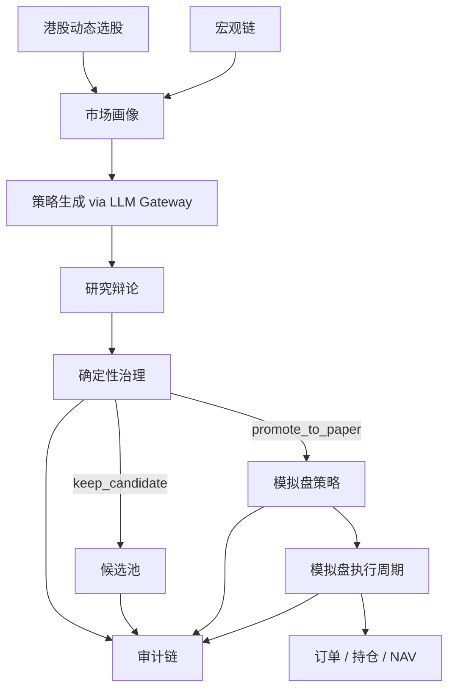

# OpenHamster

[English README](README.md) · [项目主页](https://nullwuwu.github.io/openhamster/)


[](https://www.python.org/)
[](https://vuejs.org/)
[](LICENSE)
[](https://nullwuwu.github.io/openhamster/)

> 一个会在后台持续“跑轮子”做研究的策略工厂：强调市场感知、确定性治理，以及先把模拟盘和审计链做实。

## 为什么做这个项目

很多 Agent Trading demo 强调“会不会动”，OpenHamster 更强调“为什么能动，以及为什么此刻不该动”。

它优先回答的是一组运营与治理问题：
- 当前正在研究哪个标的，为什么是它？
- 这条策略是谁提出的，用了哪个 provider 和 prompt 契约？
- 为什么这条策略被拒绝、保留为候选，还是晋级到模拟盘？
- 如果模拟盘净值不动，是价格没动、无需调仓，还是运行异常？
- 宏观链是健康、降级，还是在复用最近一次可用上下文？

## OpenHamster 现在能做什么

- 港股动态选股，而不是固定死跑一个标的
- 通过统一 `LLM Gateway` 做市场感知型策略生成
- 用确定性治理规则做候选保留、晋级和阻断
- 本地维护模拟盘订单、持仓与 NAV 账本
- 用 Dashboard 暴露运行状态、研究证据、模拟盘结果和审计链

当前运行时 provider：
- `minimax`
- `mock`

当前市场与数据范围：
- 港股主线
- 价格链路：`tencent`、`akshare`、`yfinance`、`stooq`
- 宏观链路：`FRED`、`World Bank`、`last known context`

明确不做：
- 券商真实执行
- 自动实盘交易
- 旧版 MCP / orchestrator 路径
- 新闻驱动的生产级交易流

## 当前产品形态

```text
Backend API      src/openhamster/api
Frontend         apps/web
LLM gateway      src/openhamster/llm_gateway.py
Event pipeline   src/openhamster/events
Runtime storage  var/db, var/logs, var/cache
```



## Dashboard 页面

- `/command`：运行心跳、席位主角、阻断项、模拟盘摘要
- `/candidates`：候选排序、冷却期、晋级资格
- `/research`：研究证据、市场理由、辩论结果、质量报告
- `/paper`：当前策略、持仓、净值曲线、执行解释
- `/audit`：决策时间线、选股变化、provider 与宏观事件

## 快速开始

### 后端

```bash
pip install -e .[dev]
alembic upgrade head
openhamster-api
```

### 前端

```bash
npm install --prefix apps/web
npm run dev --prefix apps/web
```

默认本地入口：
- frontend：`http://127.0.0.1:5173`
- backend：`http://127.0.0.1:8000`

Mac mini 长期运行方式：

```bash
bash scripts/start_local_daemon.sh
```

## 配置

配置优先级：

```text
defaults < config/base.yaml < config/local.yaml < .env < .env.local < environment variables
```

推荐放置方式：
- 本地非敏感覆盖：`config/local.yaml`
- 密钥：`.env.local`
- 运行时开关：数据库中的 runtime overrides

重点文档：
- [docs/configuration.md](docs/configuration.md)
- [docs/CONFIG_BOUNDARIES.md](docs/CONFIG_BOUNDARIES.md)
- [docs/RUNBOOK.md](docs/RUNBOOK.md)

## 开源协作入口

- [CONTRIBUTING.md](CONTRIBUTING.md)
- [SECURITY.md](SECURITY.md)
- [CODE_OF_CONDUCT.md](CODE_OF_CONDUCT.md)
- [docs/README.md](docs/README.md)

## 发布信息

- 当前公开里程碑：`0.2.0`
- GitHub 仓库：[nullwuwu/openhamster](https://github.com/nullwuwu/openhamster)
- GitHub Pages：[nullwuwu.github.io/openhamster](https://nullwuwu.github.io/openhamster/)

## 近期方向

- 继续把港股主线下的策略工厂和审计链做扎实
- 补完整 `/api/v1` 下的回测与实验暴露面
- 提升 operator 视角下的证据包和日摘要质量
- 严格把“模拟盘成功”与“可进实盘”分开

## 参考

本次仓库对外展示层的重构，参考了公开项目 [TraderAlice/OpenAlice](https://github.com/TraderAlice/OpenAlice) 的 README 组织方式与开源入口设计。
