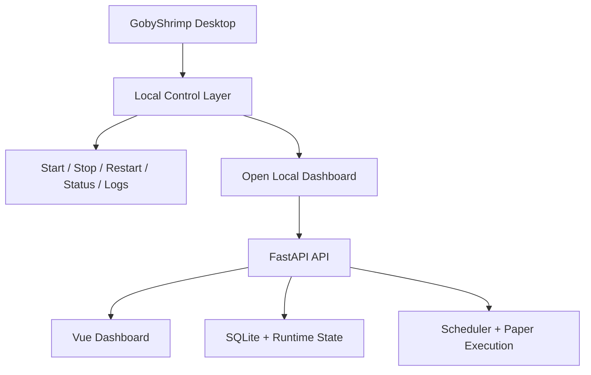

# Desktop App Packaging Proposal

## 目标
把 GobyShrimp 从“本地服务 + 浏览器”包装成一个 **Mac-only、本地控制台式桌面应用**，但不改变当前后端主线。

这份文档定义的是 **产品与系统方案**，不是本轮立刻实现的桌面壳。

## 结论先行
GobyShrimp Desktop 的正确方向不是“重写成桌面软件”，而是：
- 保留现有 FastAPI 后端
- 保留现有 Vue dashboard
- 保留本地 SQLite / runtime state
- 保留 `launchd` 长期运行能力
- 外面加一层轻壳，负责本地控制和状态展示

一句话：
**桌面壳是本地控制面，不是新的策略引擎。**

## 为什么现在只写方案，不先上壳
当前系统已经进入 `v2` 运行验证期，优先级应是：
- 继续积累 readiness 证据
- 继续跑 paper
- 继续验证 provider 和 universe 行为

这时先做重桌面壳，会过早优化交付形式，而不是研究与治理本身。

## 目标产品形态
名称建议：
- `GobyShrimp Desktop`

启动后应该发生的事情：
1. 检查本地后端服务是否已运行
2. 如果未运行，则拉起本地服务
3. 如果已运行，则直接打开本地 dashboard
4. 在桌面壳中展示最小必要控制面

## 桌面壳应该提供的 5 类能力
- `Start`
- `Stop`
- `Restart`
- `Status`
- `Logs`

这 5 类能力的目的不是替代 dashboard，而是让本地长期运行更像正式软件，而不是一组脚本。

## 桌面壳不承载的能力
明确不放进桌面壳：
- 策略生成
- 风险决策
- paper 账本逻辑
- provider 治理逻辑
- broker / live execution 逻辑

这些都继续留在现有后端 API 中。

## 推荐架构

## 与当前长期运行方案的关系
当前基线仍然是：
- `launchd + 本地服务 + 浏览器`

桌面壳不是替代它，而是对它做产品级封装。

也就是说：
- 当前 `launchd` 仍然是运行守护基线
- 桌面壳只是更友好的控制入口

## 运行与状态语义
桌面壳应直接复用现有 API，而不是绕过 API 直接读数据库。

最重要的状态来自：
- `runtime_status`
- `llm_status`
- `market_snapshot.macro_status`
- `live_readiness`
- `/runtime/logs`

桌面壳需要的额外友好字段：
- `service status`
- `uptime`
- `startup mode`
- `local logs availability`

这些字段应继续从后端 API 提供，而不是在桌面壳里重算。

## 用户视角下的桌面壳
桌面壳首页不应该重复整个 dashboard，而是只放：
- 服务是否在线
- 当前 uptime
- 最近一次成功运行
- 当前是否 degraded
- 打开 dashboard
- 打开日志
- 重启服务

真正的重信息仍然留在 dashboard：
- research
- candidates
- paper
- audit
- readiness

## 技术路线边界
当前只固定以下约束：
- `Mac-only`
- 不提前锁死 `Tauri` 或 `Electron`
- 本地 HTTP 服务仍是唯一后端
- 桌面壳只是本地控制面

为什么不现在定技术栈：
- 这一步的关键是产品边界清楚，不是壳技术先选定
- 先把“它应该做什么，不应该做什么”定住，后续选型更稳

## 何时适合进入实现阶段
满足以下条件后，再考虑进入桌面壳实现：
- `v2` readiness 证据已经稳定积累
- 本地长期运行方案已经稳定
- `launchd` 守护和日志链路已被证明足够稳定
- 对常用控制动作已形成固定流程

## 实现阶段验收要求
如果未来进入实现，至少必须满足：
- 服务未运行时能成功拉起
- 服务已运行时不会重复启动第二份
- `Start / Stop / Restart / Status / Logs` 操作稳定
- dashboard 能在本地服务就绪后正常打开
- 桌面壳异常退出不破坏后端现有长期运行机制

## 当前不做的事
- 不引入 broker 执行
- 不引入 live trading 控制
- 不让桌面壳绕过现有后端 API 直接读库
- 不为了桌面壳重写当前服务架构
